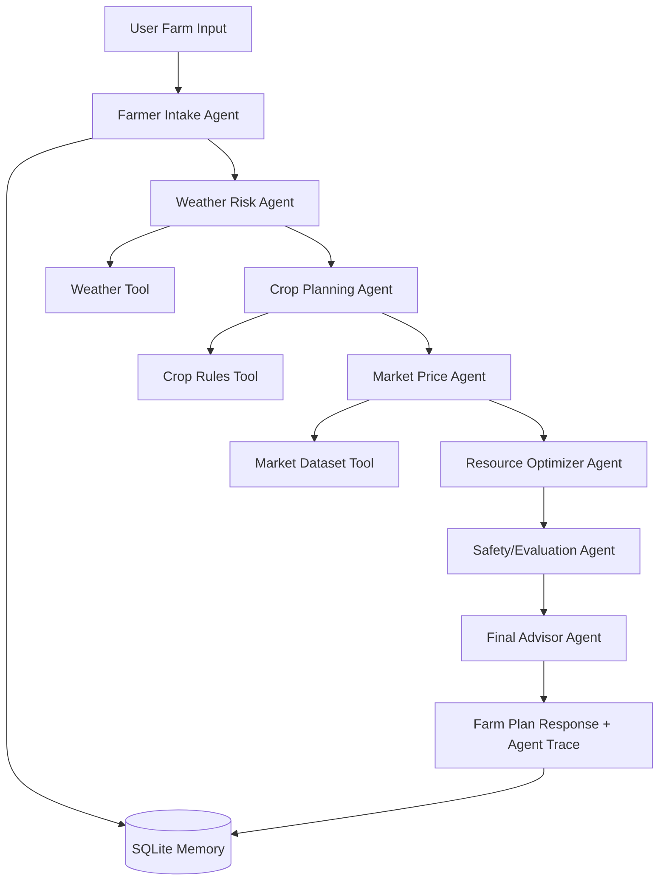

# AgriOps BD

**AgriOps BD** is a capstone-ready multi-agent AI system for smart farming, resource optimization, and market-aware crop planning in Bangladesh.

It is designed for the **AI Agents: Intensive Vibe Coding Capstone Project** style requirement: a practical AI-agent system with tools, multi-agent workflow, memory, evaluation/guardrails, and a working demo UI.

## What it does

A farmer enters location, crop, land size, soil type, budget, season, and goal. The system returns:

- Recommended crop/resource plan
- 7-day irrigation schedule
- Budget breakdown
- Market/yield/profit estimate
- Weather and crop risk warnings
- Safety and uncertainty notes
- Full agent trace showing how each agent contributed

## Agent Architecture



## Included agents

| Agent | Job |
|---|---|
| Farmer Intake Agent | Validates user input and checks memory |
| Weather Risk Agent | Uses weather sample/live API fallback to identify rain/flood/drought risk |
| Crop Planning Agent | Builds crop, fertilizer, risk and irrigation guidance |
| Market Price Agent | Estimates yield, revenue, cost and profit |
| Resource Optimizer Agent | Scores water, cost and profit based on user goal |
| Safety/Evaluation Agent | Adds guardrails and uncertainty notes |
| Final Advisor Agent | Produces final farmer-friendly recommendation |

## Tech stack

- Python 3.10+
- FastAPI backend
- Vanilla HTML/CSS/JS frontend
- SQLite memory and trace storage
- Local CSV/JSON tools
- Optional Gemini polishing with `google-genai`
- Optional official ADK-compatible agent folder

## Setup

```bash
python -m venv .venv

# Windows PowerShell
.venv\Scripts\Activate.ps1

# macOS/Linux
source .venv/bin/activate

pip install -r requirements.txt
cp .env.example .env
```

Optional: add your Gemini API key in `.env` and set:

```env
USE_GEMINI=true
GOOGLE_API_KEY=your_key_here
```

The core project works without Gemini because the agents have deterministic planning logic.

## Run the FastAPI demo

```bash
uvicorn app:app --reload
```

Open:

```text
http://127.0.0.1:8000
```

API docs:

```text
http://127.0.0.1:8000/docs
```

## API example

```bash
curl -X POST http://127.0.0.1:8000/api/plan \
  -H "Content-Type: application/json" \
  -d '{
    "farmer_name": "Rahim",
    "location": "Rangpur",
    "crop": "rice",
    "land_size_acres": 2,
    "soil_type": "Loamy",
    "budget_bdt": 50000,
    "season": "Monsoon",
    "goal": "Reduce water waste"
  }'
```

## Run the ADK-compatible agent

The `adk_agent/agriops_agent/agent.py` file follows the official ADK project style with a `root_agent` and function tools.

```bash
cd adk_agent
cp agriops_agent/.env.example agriops_agent/.env
# put GOOGLE_API_KEY in agriops_agent/.env
pip install google-adk
adk run agriops_agent
```

For ADK web UI:

```bash
cd adk_agent
adk web --port 8000
```

## Run tests

```bash
PYTHONPATH=src pytest -q
```

Windows PowerShell:

```powershell
$env:PYTHONPATH="src"
pytest -q
```

## Capstone demo script

Use this 60-90 second presentation flow:

1. Explain the problem: farmers need practical crop, water, budget and market planning.
2. Show the architecture diagram and agent list.
3. Open the web UI and enter a Rangpur rice example.
4. Show the output: recommendation, resource score, profit, 7-day irrigation schedule.
5. Show agent trace to prove it is a multi-agent workflow.
6. Mention memory: farmer profiles and traces are saved in SQLite.
7. Mention safety: exact chemical dosage is avoided; local verification is recommended.

## Why this is capstone-ready

It demonstrates:

- Tool-using agents
- Multi-agent orchestration
- Memory and session traces
- Practical real-world impact
- Evaluation/guardrails
- Working frontend and backend
- Optional ADK `root_agent` implementation

## Important limitation

The included market and weather datasets are demo/synthetic. For production, connect verified government/agriculture market feeds and local weather APIs.
